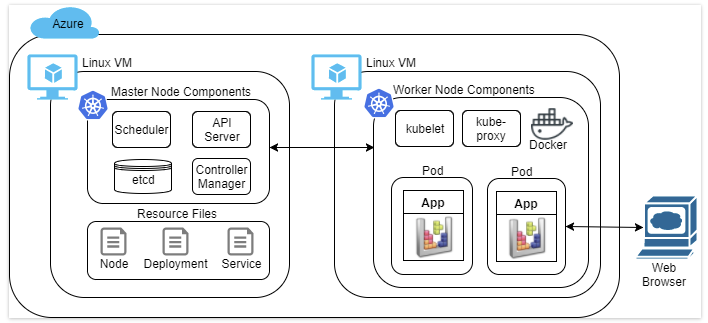
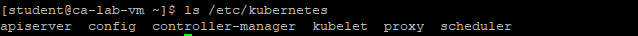

**TOPICS**

- Set up a Kubernetes master node
- Set up a Kubernetes worker node
- Deploy a stateless application in a Kubernetes cluster
- Create a Kubernetes service to allow access to the application from outside the cluster
- Effectively manage Kubernetes clusters from the command-line

The control plane node in Kubernetes provides the cluster's control plane. Thecontrol plane node makes global decisions for the cluster, such as scheduling and taking action to meet service replication requirements. Thecontrol plane node is made up of several components:

- kube-apiserver: Exposes the Kubernetes API
- etcd: Durable, consistent, persistent storage of Kubernetes objects that describe the state of your cluster
- kube-controller-manager: Runs controllers responsible for routine cluster tasks, such as detecting when nodes go down
- kube-scheduler: Selects worker nodes to assign pods to based on resource requirements and other constraints. Pods are logically grouped containers.
- Addons: Provide additional cluster features, such as DNS, and user interface

    sudo yum install -y kubernetes
    sudo yum install -y etcd

    ls /etc/kubernetes

You need to modify the apiserver, controller-manager, and config files in order to set up your control plane node. The config file holds configuration values shared across all component configurations. You are encouraged to view these files to understand what gets configured. You can use the more command to do so. For example, more /etc/kubernetes/config.

In the common config file, change the KUBE_MASTER API server address to use the control plane's DNS name

    sudo sed -i 's/\(KUBE_MASTER.*\)127.0.0.1\(.*\)/\1ca-lab-vm\2/g' /etc/kubernetes/config

 In the apiserver configuration file, change the bind address to listen on all interfaces (0.0.0.0):

    sudo sed -i 's/\(KUBE_API_ADDRESS.*\)127.0.0.1\(.*\)/\10.0.0.0\2/g' /etc/kubernetes/apiserver

Create a key to authorize API requests from pods:

    openssl genrsa -out /tmp/serviceaccount.key 2048

A specific controller called the admissions controller is responsible for authorizing API server requests. A service account is used to identify processes that run in pods. A service account called default is automatically created for this purpose. The key you created will be used to authorize the default service account requests.

Specify the service account key to use for the API server and the controller manager:

    sudo sed -i 's/\(KUBE_API_ARGS=\).*/\1"--service_account_key_file=\/tmp\/serviceaccount.key"/' /etc/kubernetes/apiserver
    sudo sed -i 's/\(KUBE_CONTROLLER_MANAGER_ARGS=\).*/\1"--service_account_private_key_file=\/tmp\/serviceaccount.key"/' /etc/kubernetes/controller-manager

Enter the following to configure etcd to also listen on all interfaces:

    sudo sed -i 's/\(ETCD_LISTEN_CLIENT_URLS.*\)localhost\(.*\)/\10.0.0.0\2/g' /etc/etcd/etcd.conf

Start, enable the services on reboot, and list the status of the services required by the control plane:

    for SERVICE in etcd kube-apiserver kube-controller-manager kube-scheduler; do
        sudo systemctl restart $SERVICE
        sudo systemctl enable $SERVICE
        sudo systemctl status $SERVICE
    done

Verify the Kubernetes API server by issuing an HTTP GET request to return all the API groups supported by the server:

    curl http://ca-lab-vm:8080/apis | more

You won't use HTTP requests to interact with Kubernetes in most circumstances, however. You will usually use the command-line utilities, graphical interfaces, or language libraries.

 Enter the following command to show the versions of supported API groups:

    kubectl api-versions

kubectl is a command-line utility for interacting with Kubernetes clusters. The Kubernetes package you installed enables tab completion for entering kubectl commands. You can press tab while entering a command to see available options and quickly learn about the commands.

 Enter the following command to re-run the last command with verbose output:

    kubectl api-versions --v=7

Create a YAML file describing a worker node resource:

    cat <<EOF > node.yml
    apiVersion: v1
    kind: Node
    metadata:
    name: k8s-node
    labels:
        # Use labels to organize nodes
        environment: dev
    spec:
    # Fully qualified domain name to reach the node (metadata.name by default)
    externalID: k8s-node
    EOF

YAML is whitespace-sensitive so it is safest to copy-paste the command. This node object describes a node and how to communicate with the node. The next Lab Step will actually configure the worker node. Note that the worker node has an externalID of k8s-node. Kubernetes is commonly abbreviated as k8s. The 8 in k8s represents the eight letters it replaces in Kubernetes. This name is resolvable by the internal DNS to the private IP of the worker node. This happens automatically because the virtual machine is named k8s-node. You can verify this by entering host k8s-node.

Create the worker node resource:

    kubectl create -f node.yml

Enter the following command to display all the node resources in the cluster along with their labels:

    kubectl get nodes --show-labels

The STATUS of the node will eventually transition from Unknown to NotReady:

n order for the worker node to be able to connect to the kube-apiserver on the control plane node, you need to open allow the connection:

    sudo systemctl stop firewalld

This stops the operating system's firewall all together. For the purpose of the Lab, this is acceptable. The Azure network security group is still protecting the VM from external networks. However, in production you would want to create firewall rules that only allow required traffic.

**Configuring a Kubernetes Worker Node**

Kubernetes worker nodes, or simply nodes, provide the runtime environment for Kubernetes. Nodes maintain running pods in the Kubernetes cluster. Kubernetes clusters can have one node to thousands of nodes. Each node is configured with several components:

- kubelet: Primary agent of the node.  Responsible for watching pods assigned to it, running the pod's containers, reporting pod status, etc.
- kube-proxy: Enables the Kubernetes service abstraction by maintaining network rules and connection forwarding
- Docker: Runs containers

This Lab will use Docker for running containers, although Kubernetes supports other container technologies. The control plane node in a Kubernetes cluster can also perform worker node tasks and therefore worker node components are also installed on control plane nodes.

In the Kubernetes common config file, change the KUBE_MASTER API server address to use the control plane's DNS name:

    sudo sed -i 's/\(KUBE_MASTER.*\)127.0.0.1\(.*\)/\1ca-lab-vm\2/g' /etc/kubernetes/config

This is the same modification made to the control plane node config file. All servers in a cluster should have the same config file.

Enter the following commands to configure the kubelet:

    # Listen on all interfaces
    sudo sed -i 's/\(KUBELET_ADDRESS.*\)127.0.0.1\(.*\)/\10.0.0.0\2/g' /etc/kubernetes/kubelet
    # Use the DNS hostname for the node
    sudo sed -i 's/\(KUBELET_HOSTNAME.*\)127.0.0.1\(.*\)/\1k8s-node\2/g' /etc/kubernetes/kubelet
    # Use the control plane's DNS name for the API server address
    sudo sed -i 's/\(KUBELET_API_SERVER.*\)127.0.0.1\(.*\)/\1ca-lab-vm\2/g' /etc/kubernetes/kubelet

Start, enable on reboot, and show the status of the required worker node services:

    for SERVICE in kube-proxy kubelet docker; do 
        sudo systemctl restart $SERVICE
        sudo systemctl enable $SERVICE
        sudo systemctl status $SERVICE 
    done

You should see a green active (running) status listed for each service:

Return to your ca-lab-vm SSH session, and re-run the following command:

    kubectl get nodes

**Deploying a Stateless Application in the Kubernetes Cluster**

 you can deploy an application in the cluster. You will use a Docker image of a game for the application. The application runs in a client web browser and doesn't store any state across sessions. The deployment you will perform in this Lab Step is effective for such stateless applications. 

 In your SSH session on the ca-lab-vm control plane node, enter the following command to create a deployment resource file:

    cat <<EOF > deployment.yml
    apiVersion: extensions/v1beta1
    kind: Deployment
    metadata:
    name: game-deployment
    spec:
    # tells deployment to run 1 pods matching the template
    replicas: 1
    # create pods using the pod definition in this template
    template: 
        metadata:
        # name is automatically generated based on the deployment.name
        labels:
            app: game
        spec:
        containers:
        - name: tetris
            image: lrakai/tetris:latest
            ports:
            - containerPort: 80
    EOF

The deployment declares a single replica and specifies a single Docker container. The container image is hosted on Docker Hub.

Create the deployment resource specified in the deployment.yml file:

    kubectl create -f deployment.yml

Get the deployment resource:

    kubectl get deployment game-deployment

Show more details about the deployment:

    kubectl describe deployment game-deployment

It has a Status of True because the minimum number of replicas for the deployment are available. There would be other conditions if the deployment failed. In the event of failed deployments, you can use this command to understand the reason the deployment failed. Under the Conditions section, only the Available condition is present

View the cluster-wide events that have been recorded by the cluster

    kubectl get events | more

You can understand the process taken for deploying the application by inspecting the Message column:

Get the pod resource created by the deployment:

    kubectl get pods

Describe the pod that is running the container in the deployment:

    kubectl describe pods | more

You can see a variety of details including Containers, and Events for the pod. You can append a specific pod name to the end of the command to describe a specific pod. In this case, there is only one pod, so there is no need to specify the name.

Describe all the pods with the label app=game: 

    kubectl get pods -l app=game

Recall that the app: game label is specified in the template metadata in the deployment.yml file. Each pod created by the deployment is assigned this label. Labels can be used to filter the output of many commands.

Create a service resource file:

    cat <<EOF > service.yml
    apiVersion: v1
    kind: Service
    metadata:
    name: game
    labels:
        app: game
    spec:
    selector:
        # Use labels to select the pods to route traffic to
        app: game
    ports:
    - protocol: TCP
        port: 80
    # Allocate a port on each node in the cluster
    type: NodePort
    EOF

A service is required to access the application from outside of the cluster.

Create the service:

    kubectl create -f service.yml

Describe the service and record what NodePort was allocated:

    kubectl describe services game

The IP value is a virtual IP within a range of addresses reserved for services.

Return to the k8s-node SSH session and enter curl ipinfo.io/ip to get the worker node's public IP address.

Disable the operating system firewall to allow external connections:

    sudo systemctl stop firewalld

Again, this is only for Lab demonstration purposes. You would only allow the required traffic through the operating system firewall in production. The Azure network security group has been configured to allow traffic on the game port already.

Return to the ca-lab-vm control plane node SSH session, and scale the application by changing the deployment replicas count to 2:

    sed -i 's/\(replicas: \).*/\12/' deployment.yml

 Apply the new resource:

    kubectl apply -f deployment.yml

Verify that the number of pods increases to 2:

    kubectl get pods -l app=game

**Cleaning Up Your Kubernetes Cluster**

Delete the game service:

    kubectl delete service game

Delete the game deployment:

    kubectl delete deployment game-deployment

Observe that the pods are automatically deleted with the deployment deletion:

    kubectl get pods

Gracefully terminate the worker node:

    kubectl drain k8s-node

The drain subcommand marks the node as unscheduable so no new pods can be assigned to it (the same as calling the cordon subcommand) and waits for graceful termination of the pods running on the node:

This is useful when taking a node out of service for maintenance.

Observe the status of the node after being drained:

    kubectl get node

The SchedulingDisabled STATUS is the result of cordoning:

Delete the worker node from the cluster:

    kubectl delete node k8s-node