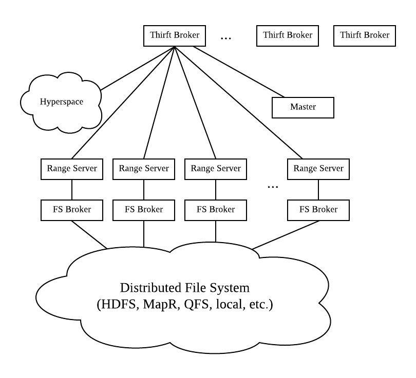

Hypertable 
Hypertable is an open source database modeled after Bigtable, Google's massively scalable database. It goes real-time at Baidu. Hypertable runs on top of a distributed file system. It supports HDFS, MapR, Ceph, KFS, and local file storage.

History 
Hypertable was released by the company Zvents at 2008, and Doug Judd promoted to the Hypertable. Baidu, the search engine in China, became project sponsor in January 2009. The development ended in March 2016.

Checkpoints 
Consistent

Hypertable backup by outputting table data in random order. Hypertable will always be back into a consistent and operational state at the checkpoint.

Concurrency Control 
Multi-version Concurrency Control (MVCC)

Hypertable uses Multi-Version Concurrency Control (MVCC). It uses auto-assign timestamps as revision numbers.

Data Model 
Column Family

Hypertable uses a set of related columns.

Foreign Keys
Not Supported

Isolation Levels 
Snapshot Isolation

Hypertable provides snapshot isolation for queries with 8-byte timestamps.

Joins 
Not Supported

Hypertable does not support Joins.

Query Interface 
Custom API Command-line / Shell

Hypertable provides the Hypertable Query Language (HQL) to create, modify, and query tables. HQL can also be used to invoke administrative commands. HQL can be interpreted by hypertable command line interface (ht shell), Thrift API methods, and Hypertable::HqlInterpreter C++ class.

Storage Architecture 
Disk-oriented

Hypertable is able to run on top of any filesystem. A File System (FS) broker process all filesystem requests. FS brokers currently support HDFS, MapR, Ceph, KFS, and local.

Storage Model
Custom

Storage Organization 
Sorted Files

Stored Procedures
Not Supported

System Architecture 
Shared-Disk

The architecture of the Hypertable is shown below. System Architecture of Hypertable Hyperspace - Hyperspace is a lock manager. It contains a filesystem to store some metadata. Equivalent to Google's Chubby service. Master - The Master handles all the meta operations. It also detects range server failures. It can re-assign ranges if necessary. Range Server - Range servers handle the reading and writing of data. FS Broker - File System (FS) broker process all filesystem requests. FS brokers currently support HDFS, MapR, Ceph, KFS, and local. ThriftBroker - ThriftBroker provides the application interface. It is implemented with Apache Thrift. It currently supports Java, PHP, Ruby, Python, Perl, and C++.

Views
Not Supported